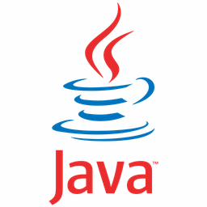
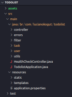

# 🛎️ Projeto TODO List - Tasks To Do List

A proposta deste projeto simplificado é desenvolver um gerenciador com a lista de tarefas a ser executada para cada um dos usuários cadastrados.

## 🎯 Índice

- [Visão Geral](#-índice)
- [Tecnologias Utilizadas](#-tecnologias-utilizadas)
- [Hierarquia de Pacotes](#hierarquia-de-pacotes)
- [Documentação de Referência](#documents-references)
- [Guias de Consulta](#-guias-de-consulta)
- [Padrões de Commit](#-padrões-de-commit)
- [FAQ](#-faq)
- [Pré-requisitos](#-pré-requisitos)
- [Primeiros Passos](#-first-steps)
- [Deploy da Coisa Toda](#deploy-da-coisa-toda)
- [Contribuição](#-contribuição)

---

## 🌐 Visão Geral

Este projeto foi desenvolvido com base no Minicurso Java disponibilizado pela Rocketseat durante o período de pré-venda do curso Java do Zero ao Avançado, desenvolvendo sua jornada de aprendizado contínuo em programação. Caso necessite de mais informações e referências do projeto, acesse o material disponível pela [Rocketseat One](https://www.rocketseat.com.br/one).

- [Visão Geral](#-índice)
---

## 🛠 Tecnologias Utilizadas

* Java 17
* Apache Maven
    * Tomcat Server Web Embedded
* Spring Boot for Maven
* H2 Console Application
* Hierarquia de Packages


|LOGO           |STACK                              |FUNÇÃO                       |
|---------------|-----------------------------------|-----------------------------|
|  | `Java 17` | Linguagem de programação escolhida para o desenvolvimento do Back-end da aplicação |
|  | `Apache Maven` | Ferramenta de gerenciamento para o build de código-fonte (construção dos artefatos para sua execução), pois padroniza o gerenciamento de dependências, execução dos testes, build e deploy da aplicação |
|  | `Tomcat Server Web Embedded` | Servidor de aplicação Java Web com recurso Embed Tomcat para se trabalhar com o Tomcat de forma embutida no artefato todo-list.jar |
|     | `Spring Boot for Maven` | Ferramenta que gerencia as classes, os pacotes, as camadas, os endpoints da aplicação, as regras de acesso a dados, bem como automatiza todo o processo de compilação de forma conjunta com o Maven |
|  | `H2 Console` | Aplicação embutida com o Spring Boot que mantém um Banco de Dados em memória, juntamente com o Tomcat Server o qual permite o acesso via Web Browser |
|   | `Hierarquia de Pacotes` | Organização dos diretórios (pastas do projeto) dentro de responsabilidades específicas para cada uma das entidades implementadas |

- [Visão Geral](#-índice)
---

## Hierarquia de Pacotes

Conceito relacionado ao conjunto de classes localizadas na mesma estrutura hierárquica de diretórios, geralmente agrupadas em pacotes comuns entre si, com o propósito de facilitar a reutilização de código
.
└── TODOLIST/
    ├── assets
    ├── src/
    │   ├── main/
    │   │   └── java/br/com/lucianokogut/
    │   │       ├── todolist/
    │   │       │   ├── controller
    │   │       │   ├── errors
    │   │       │   ├── filter
    │   │       │   ├── task
    │   │       │   ├── user
    │   │       │   ├── utils
    │   │       │   ├── HealthCheckController.java
    │   │       │   └── TodolistApplication.java
    │   │       └── resources/
    │   │           └── application.properties
    │   └── test
    ├── target/
    │   ├── classes/
    │   │   └── application.properties
    │   ├── test-classes
    │   └── todo-list-1.0.0.jar
    ├── Dockerfile
    ├── pom.xml
    └── README.md

- [Visão Geral](#-índice)
---

## Documents References

Para consultas e referências, considere observar a documentação original como nas seções abaixo:

* [Official Apache Maven Documentation](https://maven.apache.org/guides/index.html)
* [Spring Boot Maven Plugin Reference Guide](https://docs.spring.io/spring-boot/docs/3.1.4/maven-plugin/reference/html/)
* [Create an OCI image](https://docs.spring.io/spring-boot/docs/3.1.4/maven-plugin/reference/html/#build-image)
* [Spring Web](https://docs.spring.io/spring-boot/docs/3.1.4/reference/htmlsingle/index.html#web)

- [Visão Geral](#-índice)
---

## 📫 Guias de Consulta

Os guias de utilização trazem ilustrações das telas, o passo-a-passo a ser seguido e as funcionalidades disponíveis em cada uma das tecnologias utilizadas:

* [Building a RESTful Web Service](https://spring.io/guides/gs/rest-service/)
* [Serving Web Content with Spring MVC](https://spring.io/guides/gs/serving-web-content/)
* [Building REST services with Spring](https://spring.io/guides/tutorials/rest/)

- [Visão Geral](#-índice)
---

## 📤 Padrões de Commit

O commit contém os seguintes elementos estruturais, para comunicar a intenção ao utilizador da sua biblioteca:

`docs:` um commit do tipo docs atualiza algum tipo de documentação ou implementa parte de uma documentação inexistente anteriormente.

`fix:` um commit do tipo fix soluciona um problema na sua base de código (isso se correlaciona com PATCH do versionamento semântico).

`feat:` um commit do tipo feat inclui um novo recurso na sua base de código (isso se correlaciona com MINOR do versionamento semântico).

`refact:` um commit do tipo refact ajusta parte de um código ou parte da regra de negócio, que não estava evidente o suficiente na base de código original.

`break:` (Breaking Change): um commit que contém o texto `break` ou `BREAKING CHANGE`, no começo do texto do corpo opcional ou do rodapé opcional, inclui uma modificação que quebra a compatibilidade da API (isso se correlaciona com o versionamento semântico na hieraquia MAJOR). Uma *BREAKING CHANGE* pode fazer parte de commits de qualquer tipo.

`others:` são tipos de commit's adicionais para transparecer as ações realizadas além dos commit's essenciais fix:, feat: e refact:, sendo que novos tipos de commit's podem ser especificados, a exemplo do @commitlint/config-conventional (baseado na Convenção do Angular) recomenda-se, `chore:`, `style:`, `perf:`, `test:`, entre outros.

- [Visão Geral](#-índice)
---

## 🦜 Blá blá blá

**Questions 1?**

Trata-se de uma abordagem de blá blá blá e que está vinculada do blé blé blé.

No exemplo abaixo, uma aplicação de bli bli bli está segmentada em xyz componentes: **Header**, **ProductList** e **Cart**. Cada componente é desenvolvido e implantado de forma independente.


**Vantagens:**

- Desenvolvimento independente: Equipes diferentes podem trabalhar em diferentes componentes simultaneamente.
- Facilidade na manutenção: A modificação de um componente não afeta os demais.
- Deploy independente: Cada componente pode ser implantado separadamente.

**Desvantagens:**

- Comunicação entre componentes: É necessário definir uma estratégia/contrato de comunicação entre eles.
- Gerenciamento de estado: É necessário estabelecer uma estratégia para o gerenciamento de estado da aplicação.

Estas desvantagens podem ser contornadas com o uso de bibliotecas como [Redux](https://redux.js.org/) ou [MobX](https://mobx.js.org/README.html), mas é essencial **seguir as definições de contratos estipulados pela aplicação Blá blá blá com o XPTO**.

- [Visão Geral](#-índice)
---

## ❓ FAQ

**Q: Por que Manoel e não o Joaquim?**

**R:** O Joaquim é uma pessoa poderosa, mais nova e de fácil convívio. No entanto, o Manoel atende melhor às necessidades deste projeto, por ser pioneiro na implementação de padarias virtuais. Estas rotinas possuem uma vasta documentação, exemplos e soluções para resolução de problemas (troubleshooting). Além disso, o Manoel possibilita o carregamento dinâmico de farinha em pó para cada uma das padarias virtuais, funcionalidade que o Joaquim ainda não oferece.

**NOTA:** Existe um plugin para que o Joaquim permite o carregamento dinâmico de pãozinho francês, mas ainda não está em uma versão estável. Quando estiver disponível, a migração para o Joaquim, ao invés do uso do Manoel poderá ser considerada. [JoaquimPadariasVirtuais](https://repositorio.ufsc.br/bitstream/handle/123456789/109201/CCN0037-M.pdf)

**Q: Onde posso me aprofundar em Padarias Virtuais?**

**R:** Recomenda-se a leitura da documentação do TCC do Sidnei Manoel, especialmente a seção de Agradecimentos [aqui](https://repositorio.ufsc.br/bitstream/handle/123456789/109201/CCN0037-M.pdf). O canal do [JocaPadoca](https://www.youtube.com/watch?v=Yge8tZ3G_9E) no YouTube é outra ótima fonte, além do GitHub do [Padoca](https://github.com/azureash/Padoca_POO2) que possui um [repo Android](https://github.com/azureash/android) com muitos exemplos de Code Fragment.

- [Visão Geral](#-índice)
---

## 🥱 Pré-requisitos

Antes de começar, você precisará seguir as etapas abaixo:

### Contratos do Blé blé blé

Antes de iniciar o desenvolvimento das suas features é de **EXTREMA** importância a definição do que o Joaquim, o Manoel e o Sidnei Manoel desejam como novas funcionalidades, estando ciente que os contratos de desenvolvimento de software precisam ser pré-estabelecidos. Para mais informações sobre os contratos, acesse o exemplo de [contrato](https://www.cl.df.gov.br/documents/5665546/25689039/CONTRATO+PARTICULAR+DE+DESENVOLVIMENTO+DE+SOFTWARE+-+THS+-+NEOBIO+I.pdf).

1. Usar linguagem XPTO
2. Usar banco de dados MyCoxinha
3. Não alterar os pré-requisitos estabelecidos em `config do sistema` (a menos que seja ALTAMENTE necessário)
4. Não alterar as seguintes rotas de entregas de pães franceses:
    - `home/index.html`
    - `home/src/bootstrap.tsx`
    - `home/src/index.ts`
    - `home/router/index.tsx`
5. Qualquer nova rota criada deve ser adicionada no arquivo `home/router/routes.tsx`
6. Qualquer fornecedor de farinha deve ser adicionado _ABAIXO_ das rotas de entregas de pães, no endpoint `home/router/routes.tsx`, **NUNCA** acima ou nos arquivos indicados no item 4 (a menos que seja ALTAMENTE necessário)

### XPTO Project

Este projeto deve possuir força e robustez o suficiente para manter o Design System em todas as Padarias Virtuais, sendo um projeto privado, sendo obrigatório o uso de algumas ferramentas e execução de alguns passos para conseguir utilizá-la:

1. **GitHub Token**
    1.1 Certifique-se de solicitar acesso ao repositório correto das Padarias Virtuais. [Padoca](https://github.com/azureash/Padoca_POO2)

    1.2 Acesse o [userName no GitHub](https://github.com/azureash) e se agarre no terço para que tudo esteja certo PIÁ!
        Certifique-se de selecionar os seguintes escopos:
        - api-padoca
            - read-api
            - read-repository
            - read-registry
            - write-registry

    1.3 Reze o terço pelo menos uma vez.

2. **Configuração do GitHub**
    **MakeFile**
    O arquivo de script do MakeFile possui alguns comandos que facilitam a instalação Padaria Virtual a primeira vez, mas para isso, se faz necessário configurar algumas variáveis de ambiente:

    2.1 Execute o comando `make set-gitlab-token SEUGITTOKEN`

    2.2 Substitua o `SEUGITTOKEN` pelo Token gerado no passo anterior.

    2.3 RE-INICIE SEU TERMINAL (esta etapa é necessária para recuperação das variáveis de ambiente)

    2.4 Execute o comando `make gitlab-registry`

    2.5 RE-INICIE SEU TERMINAL (esta etapa é necessária para que as variáveis de ambiente sejam atualizadas)

    AGORA você pode instalar a Padaria Virtual com o comando `npm install @padaria/virtual`

    **MANUAL**
    Caso não queira utilizar o script do MakeFile será necessário configurar as variáveis de ambiente manualmente:

    2.1 Crie uma variável de ambiente chamada `GITLAB_TOKEN` e atribua o Token gerado no passo anterior.
        (a variável de ambiente deve existir no seu arquivo `~/.bashrc` ou `~/.zshrc`)

    2.2 RE-INICIE SEU TERMINAL (essa etapa é necessária para que as variáveis de ambiente sejam atualizadas)

    2.3 Execute os seguintes comandos:

    ```bash
        npm config set @padaria:registry https://gitlab.com/api/v4/projects/45404042/packages/npm/
    ```

    ```bash
        npm config set '//gitlab.com/api/v4/projects/45404042/packages/npm/:_authToken' "${GITLAB_TOKEN}"
    ```

    2.4 RE-INICIE SEU TERMINAL (essa etapa é necessária para que as variáveis de ambiente sejam atualizadas)

    AGORA você pode instalar a Padaria Virtual de forma manualmente, com o comando `npm install @padaria/virtual`

Para mais informações sobre a Padaria Virtual, acesse a [documentação](https://repositorio.ufsc.br/bitstream/handle/123456789/109201/CCN0037-M.pdf).

- [Visão Geral](#-índice)
---

## 🚀 First Steps

Para começar a usar o projeto e assar seus pãezinhos franceses:

1. Clone o Repositório Template

```bash
git clone https://github.com/azureash/android
```

2. Navegue até o Diretório

```bash
cd sei-la
```

3. Instale as Dependências

```bash
npm install
```

4. Execute o Projeto

```bash
npm run dev
```

### Configuração do PadocaVirtualApp

Agora é necessário alterar as informações do PadocaVirtualApp no arquivo `package.json`:

1. Edite o arquivo `package.json`, essa etapa é importante para atribuir um AppDefault (PadocaVirtualApp) que identificará seu projeto

```json
{
  "name": "padoca-virtual-app", <-- Nome do seu repositório
  ...
}
```

2. Remova a branch git-origin e substitua pelo seu repositório de uso para desenvolvimento ou testes:

```bash
git remote remove origin
git remote add origin <SEU_REPOSITORIO>
```
- [Visão Geral](#-índice)
---

## Deploy da Coisa Toda

Por se tratar de um Projeto React, o deploy de toda a aplicação é feita de forma simplificada, bastando "largar" o comando:

```bash
npm run build
```

O comando acima vai deixar tudo preparado no diretório `dist` para "largar o barro" o mais rápido possível e conforme a necessidade de cada deploy.

- [Visão Geral](#-índice)
---

## 🤝 Contribuição

Estamos dispostos a escutar suas contribuições e receber sua colaboração! Se você encontrar algum problema, algum dilema em alguma rotina já idealizada, ou se quiser recomendar alguma funcionalidade nova, sinta-se à vontade para criar um Pull Request.

Qualquer dúvida, entre em contato conosco.

[Joaquim](acredito_no_noel@outlook.com.br)

[Manoel](seu_marido@outlook.com)

- [Visão Geral](#-índice)
---